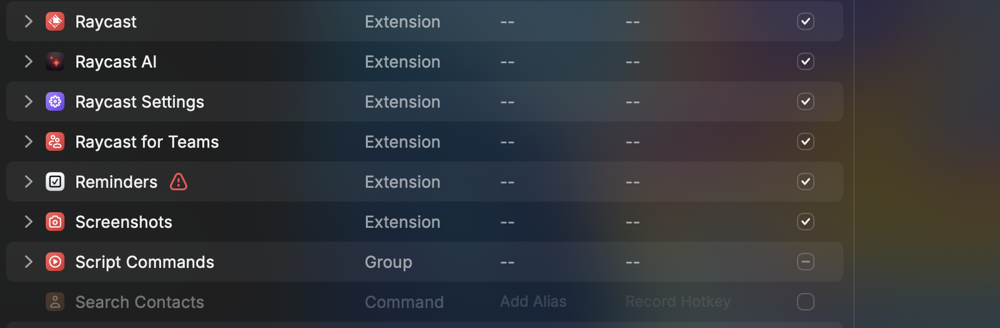

## Plug-n-play

A script which you can integrate in your `Raycast` tool to open any pdf directly in `Preview` app of `MacOS`

:info: Somethings to keep track of before using the tool

- Change your destination folder in `destination` in the source code

- You can configure your script to run with a keyboard shortcut by setting up it in Raycast settings
- Press `<Cmd-Space>` 
- Press `<Cmd-,>`
- Click on `Script Commands` in the below window

- Ensure that `plug-n-play` is enabled and by clicking on `Record hotkey` you can set any key by which you can directly access the script

_Like this:_

Voila, you are now good to open any PDFs in your local system if you know the URL.

Please star it if you like this hack. 

TODO: Make this a raycast extension to provide more customizability