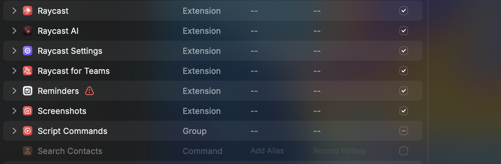

## Plug-n-play

A script which you can integrate in your `Raycast` tool to open any pdf directly in `Preview` or your default pdf-reader app of `MacOS`

:info: Somethings to keep track of before using the tool

### Steps to setup your own plug-n-play

- Press `<Cmd-Space>` 
- Press `<Cmd-,>`
- Click on `Script Commands` in the below window

- It might happen that your `Raycast` installation doesn't know in which directory your scripts are installed, in that case, link your directory where you cloned the following repo
- Ensure that `plug-n-play` is enabled and by clicking on `Record hotkey` you can set any key by which you can directly access the script. I use `<C-p>` but its upto you.

 > Tip: You can change where your PDFs are stored by changing it in `destination` variable in the shell script.

Voila, you are now good to open any PDFs in your local system when you know the URL.

If you liked it, Please provide a star. Thanks.

### TODO

- Make this a `Raycast` extension to provide more functionality
